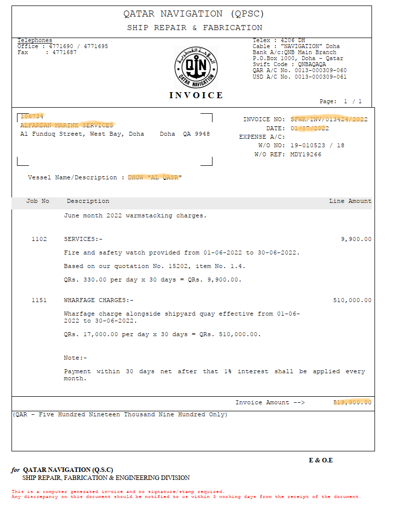
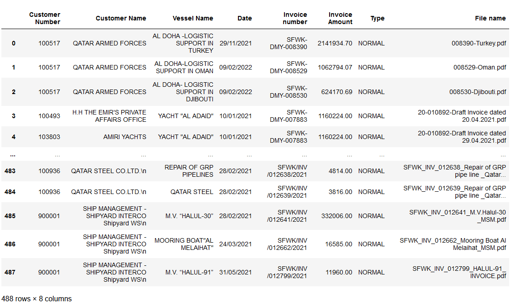
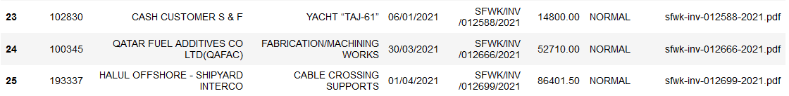
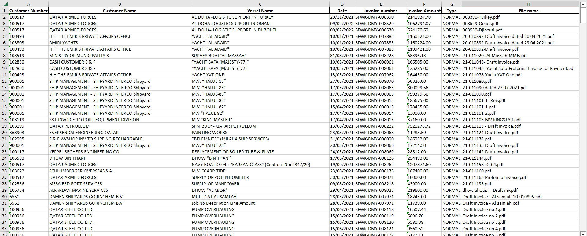

# The task is to scrape these from set of pdf files

## Data that has to be scraped

- Customer Number
- Customer Name
- Vessel Name/Description
- INVOICE NO
- DATE
- Invoice Amount

Example of Invoices that need to be scraped (*required data is highlighted*): 



Program starts with converting PDF file to text using **pdfplumber** library of python.

```python
with pdfplumber.open("Invoices/"+file) as pdf:
        for page in pdf.pages:
            text += page.extract_text() + "\n"
```

Then using **regular expressions** we are searching for required data in the text.

```python
inv_no = re.findall(r"[A-Z]{4}-[A-Z]{3}-[0-9]{6}|[A-Z]{4}/[A-Z]{3}/[0-9]{6}\s*/[0-9]{4}", text)[0]

date = re.findall(r"[0-9]{2}/[0-9]{2}/[0-9]{4}", text)[0]

for line in text.split("\n"):
    if re.match(r"INVOICE\s*NO\s*:", line):
        cus_no = line.split()[0]
    if re.match(r"DATE\s*:", line):
        cus_name = line.split()[0]

inv_amount_str = re.findall(r"Invoice\sAmount\s-->\s*([\d,]+\.\d+)?", text)[0]
inv_amount = re.sub(r',', '', inv_amount_str)


cus_no = re.findall(r"Page:\s*\d\s*/\s*\d+\n(\d{4,6})", text, flags=re.DOTALL)[0]
cus_name = re.findall(r"INVOICE\s*NO\s*:\s\S+\n(.*?)DATE\s*:", text, flags=re.DOTALL)[0]

vessel_name = re.findall(r"Vessel\s*Name/Description\s*:\s*(.*)", text)[0]
```

After going through the cycle with all pdf files given by client we got this pandas dataframe:



However some rows are empty! That's because some pdf files are secured and cannot be converted to text with pdfplumber or other libraries for manipulating pdf files. 

That's why I decided to filter those file out and use OCR to recognize text from those images converted from pdf files.

Here are some libraries used for these purposes:

```python
import fitz
from PIL import Image
import pytesseract
```

Code that performs OCR:

```python
def pdf_to_images(pdf_path):
    pdf_document = fitz.open(pdf_path)
    images = []

    for page_number in range(pdf_document.page_count):
        page = pdf_document.load_page(page_number)
        image = page.get_pixmap(matrix=fitz.Matrix(300 / 72, 300 / 72))
        images.append(image)

    return images

def perform_ocr(image):
    text = pytesseract.image_to_string(image)
    return text
```

After running cycle with my script through filtered Invoices:



Final result was requested by client in a form of excel table:


